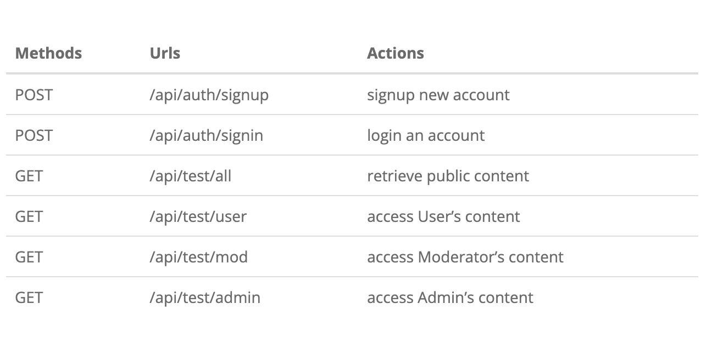

# Node.js – JWT Authentication & Authorization example with JSONWebToken & Sequelize

## Token Based Authentication

Comparing with Session-based Authentication that need to store Session on Cookie, the big advantage of Token-based Authentication is that we store the JSON Web Token (JWT) on Client side: Local Storage for Browser, Keychain for IOS and SharedPreferences for Android… So we don’t need to build another backend project that supports Native Apps or an additional Authentication module for Native App users.

There are three important parts of a JWT: Header, Payload, Signature. Together they are combined to a standard structure: header.payload.signature.

`Authorization: Bearer [header].[payload].[signature]`

## Overview of Node.js Express JWT Authentication example

We will build a Node.js Express application in that:

User can signup new account, or login with username & password.

By User’s role (admin, moderator, user), we authorize the User to access resources

This is our Node.js application demo running with MySQL database and test Rest Apis with Postman.

These are APIs that we need to provide:



Via Express routes, HTTP request that matches a route will be checked by CORS Middleware before coming to Security layer.

Security layer includes:

JWT Authentication Middleware: verify SignUp, verify token

Authorization Middleware: check User’s roles with record in database

If these middlewares throw any error, a message will be sent as HTTP response.

Controllers interact with MySQL Database via Sequelize and send HTTP response (token, user information, data based on roles…) to client.

## Technology

Express 4.18.2

bcryptjs 2.4.3

jsonwebtoken 9.0.0

Sequelize 6.32.1

MySQL

## Project Structure

**– config**

configure MySQL database & Sequelize

configure Auth Key

**– routes**

auth.routes.js: POST signup & signin

user.routes.js: GET public & protected resources

**– middlewares**

verifySignUp.js: check duplicate Username or Email

authJwt.js: verify Token, check User roles in database

**– controllers**

auth.controller.js: handle signup & signin actions

user.controller.js: return public & protected content

**– models for Sequelize Models**

user.model.js

role.model.js

**– server.js:**

import and initialize necessary modules and routes, listen for connections.

## STEPS TO DO :

## Create Node.js App

First, we create a folder for our project:

```Python
mkdir node-js-jwt-auth
cd node-js-jwt-auth
```

Then we initialize the Node.js App with a package.json file:

```
npm init

name: (node-js-jwt-auth)
version: (1.0.0)
description: Node.js Demo for JWT Authentication
entry point: (index.js) server.js
test command:
git repository:
keywords: node.js, express, jwt, authentication, mysql
author: bezkoder
license: (ISC)

Is this ok? (yes) yes
```

We need to install necessary modules: **express, cors, sequelize, mysql2, jsonwebtoken and bcryptjs.**

Run the command:

`npm install express sequelize mysql2 cors jsonwebtoken bcryptjs --save`

The package.json file now looks like this:

```
{
  "name": "node-js-jwt-auth",
  "version": "1.0.0",
  "description": "Node.js Demo for JWT Authentication",
  "main": "server.js",
  "scripts": {
    "test": "echo \"Error: no test specified\" && exit 1"
  },
  "keywords": [
    "node.js",
    "jwt",
    "authentication",
    "express",
    "mysql"
  ],
  "author": "bezkoder",
  "license": "ISC",
  "dependencies": {
    "bcryptjs": "^2.4.3",
    "cors": "^2.8.5",
    "express": "^4.18.2",
    "jsonwebtoken": "^9.0.0",
    "mysql2": "^2.3.3",
    "sequelize": "^6.32.1"
  }
}

```

**Setup Express web server**

In the root folder, let’s create a new server.js file:

```
const express = require("express");
const cors = require("cors");

const app = express();

var corsOptions = {
  origin: "http://localhost:8081"
};

app.use(cors(corsOptions));

// parse requests of content-type - application/json
app.use(express.json());

// parse requests of content-type - application/x-www-form-urlencoded
app.use(express.urlencoded({ extended: true }));

// simple route
app.get("/", (req, res) => {
  res.json({ message: "Welcome to bezkoder application." });
});

// set port, listen for requests
const PORT = process.env.PORT || 8080;
app.listen(PORT, () => {
  console.log(`Server is running on port ${PORT}.`);
});

```

Let me explain what we’ve just done:

– import express and cors modules:

Express is for building the Rest apis

cors provides Express middleware to enable CORS

– create an Express app, then add request body parser and cors middlewares using app.use() method. Notice that we set origin: http://localhost:8081.

– define a GET route which is simple for test.

– listen on port 8080 for incoming requests.

Now let’s run the app with command: node server.js.

Open your browser with url http://localhost:8080/, you will see:
